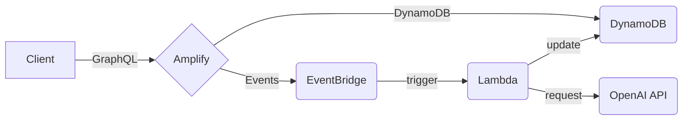
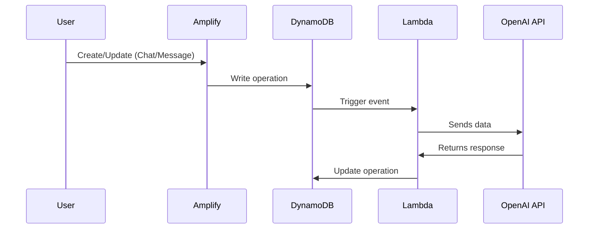
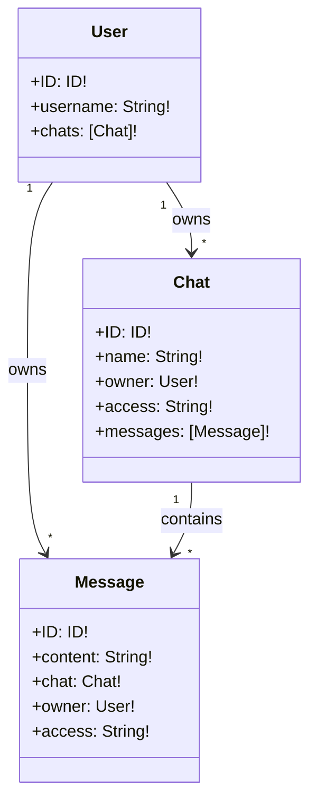

# Architecture

## System Components

```mermaid
graph LR
  A[Client] -- GraphQL --> B{Amplify}
  B -- DynamoDB --> C(DynamoDB)
  B -- Events --> D(EventBridge)
  D -- trigger --> E(Lambda)
  E -- request --> F(OpenAI API)
  E -- update --> C
```

## Event Flow

```mermaid
sequenceDiagram
  participant User as User
  participant Amplify as Amplify
  participant DynamoDB as DynamoDB
  participant Lambda as Lambda
  participant OpenAI as OpenAI API
  User->>Amplify: Create/Update (Chat/Message)
  Amplify->>DynamoDB: Write operation
  DynamoDB->>Lambda: Trigger event
  Lambda->>OpenAI: Sends data
  OpenAI->>Lambda: Returns response
  Lambda->>DynamoDB: Update operation
```

## Data Model

```mermaid
classDiagram
  class User {
    +ID: ID!
    +username: String!
    +chats: [Chat]!
  }
  class Chat {
    +ID: ID!
    +name: String!
    +owner: User!
    +access: String!
    +messages: [Message]!
  }
  class Message {
    +ID: ID!
    +content: String!
    +chat: Chat!
    +owner: User!
    +access: String!
  }
  User "1" --> "*" Chat: owns
  User "1" --> "*" Message: owns
  Chat "1" --> "*" Message: contains

```
